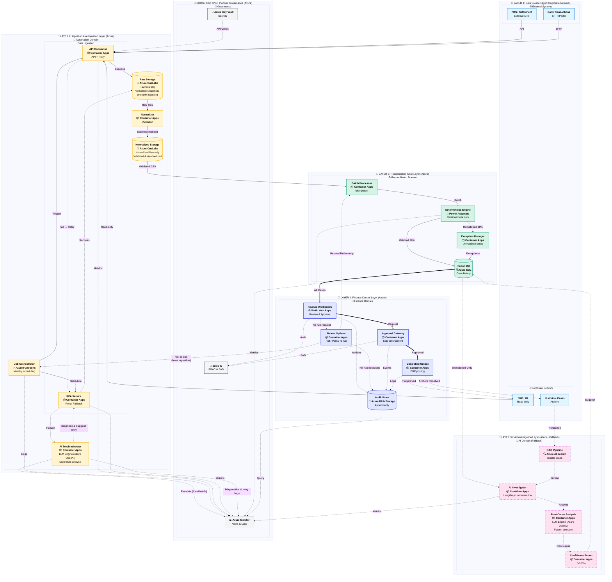

# ERP-GL Reconciliation System - Architecture Diagram (Layers View)

**レイアウト**: レイヤー構造を縦並びに配置

---

## System Architecture Overview (Layers View)

**レイアウトの特徴**:
- ✅ レイヤーが縦に明確に分離
- ✅ データフローが上から下へ流れる
- ✅ 各レイヤーに「📍 LAYER X:」ラベル付き
- ✅ Governanceは横断的に配置
