# ERP-GL Reconciliation System - Architecture Diagram (Swimlane View)

**レイアウト**: スイムレーン形式で横並びに配置

---

## System Architecture Overview (Swimlane View)

```mermaid
%%{init: {'theme':'base', 'themeVariables': {'fontSize':'16px', 'fontFamily':'Arial'}}}%%
flowchart LR
    subgraph DataSource["🌐 Data Source<br/>(Corporate Network)"]
        direction TB
        POS["<b>POS /<br/>Settlement</b><br/>External APIs"]
        Bank["<b>Bank<br/>Transactions</b><br/>SFTP/Portal"]
        ERP["<b>ERP /<br/>GL</b><br/>Read-Only"]
        History["<b>Historical<br/>Cases</b><br/>Archive"]
    end

    subgraph Ingestion["🤖 Ingestion & Automation<br/>(Azure)"]
        direction TB
        Orchestrator["<b>Job Orchestrator</b><br/>⚡ <b>Azure Functions</b><br/>Monthly scheduling"]
        APIConnector["<b>API Connector</b><br/>📦 <b>Container Apps</b><br/>API + Retry"]
        RPA["<b>RPA Service</b><br/>📦 <b>Container Apps</b><br/>Portal Fallback"]
        AITroubleshooter["<b>AI Troubleshooter</b><br/>📦 <b>Container Apps</b><br/>LLM Engine (Azure OpenAI)<br/>Diagnostic analysis"]
        RawStorage[("<b>Raw Storage</b><br/>💾 <b>Azure OneLake</b><br/>Raw files only<br/>Versioned snapshots")]
        Normalizer["<b>Normalizer</b><br/>📦 <b>Container Apps</b><br/>Validation"]
        NormalizedStorage[("<b>Normalized Storage</b><br/>💾 <b>Azure OneLake</b><br/>Normalized files only<br/>Validated & standardized")]

        Orchestrator --> APIConnector
        APIConnector --> RawStorage
        APIConnector -.-> RPA
        RPA -.-> AITroubleshooter
        RawStorage --> Normalizer
        Normalizer --> NormalizedStorage
    end

    subgraph Reconciliation["⚙️ Reconciliation Core<br/>(Azure)"]
        direction TB
        BatchProcessor["<b>Batch Processor</b><br/>📦 <b>Container Apps</b><br/>Idempotent"]
        Engine["<b>Deterministic Engine</b><br/>🔄 <b>Power Automate</b><br/>Versioned rule sets"]
        ExceptionMgr["<b>Exception Manager</b><br/>📦 <b>Container Apps</b><br/>Unmatched cases"]
        RecDB[("<b>Recon DB</b><br/>🗄️ <b>Azure SQL</b><br/>Case history")]

        BatchProcessor --> Engine
        Engine -->|"90%"| RecDB
        Engine -->|"10%"| ExceptionMgr
        ExceptionMgr --> RecDB
    end

    subgraph AI["🧠 AI Investigation<br/>(Azure - Fallback)"]
        direction TB
        AIInvestigator["<b>AI Investigator</b><br/>📦 <b>Container Apps</b><br/>LangGraph orchestration"]
        RootCauseAnalysis["<b>Root Cause Analysis</b><br/>📦 <b>Container Apps</b><br/>LLM Engine (Azure OpenAI)<br/>Pattern detection"]
        RAGPipeline["<b>RAG Pipeline</b><br/>🔍 <b>Azure AI Search</b><br/>Similar cases"]
        ConfidenceEngine["<b>Confidence Scorer</b><br/>📦 <b>Container Apps</b><br/>0-100%"]

        AIInvestigator --> RootCauseAnalysis
        RAGPipeline --> AIInvestigator
        RootCauseAnalysis --> ConfidenceEngine
    end

    subgraph Finance["👥 Finance Control<br/>(Azure)"]
        direction TB
        Workbench["<b>Finance Workbench</b><br/>🌐 <b>Static Web Apps</b><br/>Review & Approve"]
        RerunOptions["<b>Re-run Options</b><br/>📦 <b>Container Apps</b><br/>Full / Partial re-run"]
        ApprovalGateway["<b>Approval Gateway</b><br/>📦 <b>Container Apps</b><br/>SoD enforcement"]
        ControlledOutput["<b>Controlled Output</b><br/>📦 <b>Container Apps</b><br/>ERP posting"]
        AuditStore[("<b>Audit Store</b><br/>💾 <b>Azure Blob Storage</b><br/>Append-only")]

        Workbench --> ApprovalGateway
        ApprovalGateway --> ControlledOutput
        ControlledOutput --> AuditStore
    end

    subgraph Governance["🔐 Governance<br/>(Azure)"]
        direction TB
        KeyVault["🔑 <b>Azure Key Vault</b><br/>Secrets"]
        Monitor["📊 <b>Azure Monitor</b><br/>Alerts & Logs"]
        RBAC["👤 <b>Entra ID</b><br/>RBAC & SoD"]
    end

    %% Cross-lane Primary Data Flow
    POS -->|"API"| APIConnector
    Bank -->|"SFTP"| APIConnector
    ERP -->|"Read-only"| APIConnector

    APIConnector -->|"Success"| RawStorage
    APIConnector -.->|"Fail"| RPA
    RPA -.->|"Success"| RawStorage
    RPA -.->|"Failure"| AITroubleshooter
    AITroubleshooter -.->|"Diagnose"| RPA
    AITroubleshooter -.->|"Escalate"| Monitor

    NormalizedStorage -->|"Validated CSV"| BatchProcessor

    %% AI Fallback Flow
    RecDB -.->|"Unmatched"| AIInvestigator
    History -.->|"Reference"| RAGPipeline
    ConfidenceEngine -.->|"Suggest"| RecDB

    %% Finance Control Flow
    RecDB ==>|"All Cases"| Workbench
    Workbench -.->|"Re-run request"| RerunOptions
    RerunOptions -.->|"Full re-run (from ingestion)"| Orchestrator
    RerunOptions -.->|"Reconciliation only"| BatchProcessor
    ControlledOutput -.->|"If Approved"| ERP
    ControlledOutput -.->|"Archive"| History

    %% Governance/Monitoring
    KeyVault -.->|"Creds"| APIConnector
    Orchestrator -.->|"Logs"| Monitor
    APIConnector -.->|"Metrics"| Monitor
    RPA -.->|"Metrics"| Monitor
    AITroubleshooter -.->|"Diagnostics"| Monitor
    Engine -.->|"Metrics"| Monitor
    AIInvestigator -.->|"Metrics"| Monitor
    Workbench -.->|"Actions"| AuditStore
    RerunOptions -.->|"Re-run decisions"| AuditStore
    ApprovalGateway -.->|"Events"| AuditStore
    ControlledOutput -.->|"Logs"| AuditStore
    AuditStore -.->|"Query"| Monitor
    Workbench -.->|"Auth"| RBAC
    ApprovalGateway -.->|"SoD"| RBAC

    %% Styling by Domain
    classDef sourceStyle fill:#e1f5ff,stroke:#0078d4,stroke-width:2px,color:#000
    classDef automationStyle fill:#fff4ce,stroke:#f7b500,stroke-width:2px,color:#000
    classDef reconcileStyle fill:#d5f4e6,stroke:#10a37f,stroke-width:2px,color:#000
    classDef aiStyle fill:#ffe0f0,stroke:#d946ef,stroke-width:2px,stroke-dasharray: 5 5,color:#000
    classDef financeStyle fill:#e0e7ff,stroke:#6366f1,stroke-width:3px,color:#000
    classDef governanceStyle fill:#f3f4f6,stroke:#6b7280,stroke-width:2px,color:#000

    class POS,Bank,ERP,History sourceStyle
    class Orchestrator,APIConnector,RPA,RawStorage,NormalizedStorage,Normalizer,AITroubleshooter automationStyle
    class RecDB,Engine,BatchProcessor,ExceptionMgr reconcileStyle
    class AIInvestigator,RootCauseAnalysis,RAGPipeline,ConfidenceEngine aiStyle
    class Workbench,RerunOptions,ApprovalGateway,ControlledOutput,AuditStore financeStyle
    class KeyVault,Monitor,RBAC governanceStyle
```

**レイアウトの特徴**:
- ✅ スイムレーンが横に並ぶ
- ✅ データフローが左から右へ流れる
- ✅ 各レーンが独立したドメイン
- ✅ クロスレーン連携が明確
