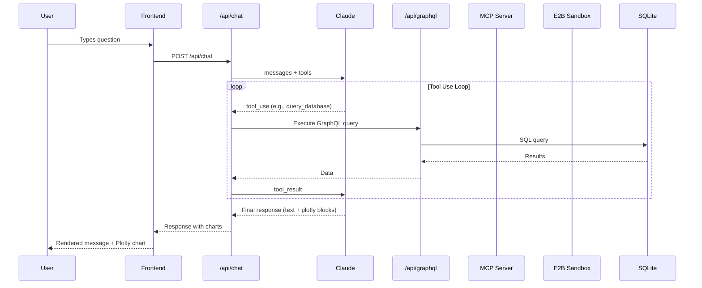

# System Architecture

## Components

### 1. Next.js Application (Frontend + API)

The main application serves both the UI and backend API routes.

- **Frontend**: React components with Tailwind CSS styling
- **API Routes**: Next.js App Router handlers for `/api/chat` and `/api/graphql`

### 2. SQLite Database

Local file-based database (`data/mmm.db`) storing marketing spend and performance metrics.

- Managed via `better-sqlite3` (synchronous, fast)
- Seeded with 52 weeks of synthetic data across 5 channels

### 3. GraphQL API

Powered by `graphql-yoga`, exposes structured queries over the SQLite data.

- Mounted at `/api/graphql`
- Provides GraphiQL playground for development

### 4. MCP Server

A standalone Node.js process implementing the Model Context Protocol.

- Communicates via stdio (spawned as a subprocess)
- Exposes 3 pre-built MMM analysis tools
- Reads directly from the SQLite database

### 5. Claude LLM (Anthropic)

The AI assistant that orchestrates analysis through tool use.

- Receives user messages via `/api/chat`
- Has access to 3 tools: `query_database`, `run_python_analysis`, `run_mmm_analysis`
- Iterates through tool calls until producing a final response

### 6. E2B Sandbox

Cloud-based Python execution environment for custom analysis.

- Executes LLM-generated Python code safely
- Returns stdout/stderr output
- Isolated from the host system

## Data Flow

## Technology Choices

| Decision | Choice | Rationale |
|----------|--------|-----------|
| Framework | Next.js App Router | Full-stack React with API routes |
| Database | SQLite + better-sqlite3 | Zero-config, synchronous, perfect for demo |
| GraphQL | graphql-yoga | Lightweight, works with Next.js App Router |
| LLM | Claude (Anthropic) | Strong tool-use capabilities |
| MCP SDK | @modelcontextprotocol/sdk | Standard protocol for tool exposure |
| Charts | Plotly.js + react-plotly.js | Rich interactive visualizations |
| Code Execution | E2B | Secure sandboxed Python execution |
| Styling | Tailwind CSS | Rapid UI development |
