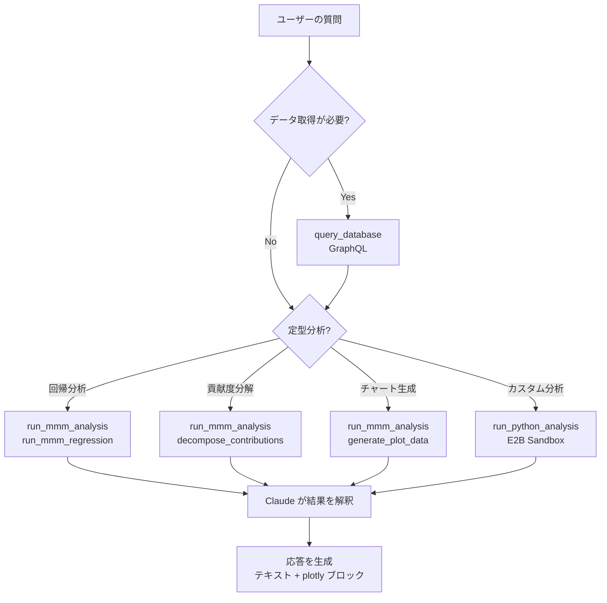

# サンプル呼び出しシナリオ

Claude がユーザーの質問に応答する際、内部で GraphQL・MCP・E2B の各ツールをどのように呼び出すかを具体例で示します。

---

## シナリオ 1: チャネル別支出の時系列チャート

**ユーザー入力**: 「チャネルごとの週次支出推移をグラフで見せて」

### Step 1 — Claude が MCP ツールを呼び出し

Claude は `run_mmm_analysis` ツールで `generate_plot_data` を実行：

```json
{
  "tool_name": "generate_plot_data",
  "arguments": {
    "chart_type": "spend_over_time"
  }
}
```

### Step 2 — MCP サーバーの処理

MCP サーバー (`mcp-server/build/index.js`) が SQLite から全チャネルの週次支出データを取得し、Plotly 互換の JSON を返却：

```json
{
  "data": [
    {
      "x": ["2023-01-02", "2023-01-09", "..."],
      "y": [52340, 48120, "..."],
      "type": "scatter",
      "mode": "lines",
      "name": "TV"
    },
    {
      "x": ["2023-01-02", "2023-01-09", "..."],
      "y": [31200, 28900, "..."],
      "type": "scatter",
      "mode": "lines",
      "name": "Search"
    }
  ],
  "layout": {
    "title": "Weekly Spend by Channel",
    "xaxis": { "title": "Week" },
    "yaxis": { "title": "Spend ($)" }
  }
}
```

### Step 3 — フロントエンドのレンダリング

Claude の応答に含まれる ` ```plotly {...}``` ` ブロックを ChatPanel が検出し、GraphViewer に Plotly データを渡してインタラクティブなチャートを描画。

---

## シナリオ 2: 収益への回帰分析

**ユーザー入力**: 「各チャネルが収益にどの程度影響しているか分析して」

### Step 1 — Claude が MCP ツールを呼び出し

```json
{
  "tool_name": "run_mmm_regression",
  "arguments": {
    "target": "revenue"
  }
}
```

### Step 2 — MCP サーバーの OLS 回帰処理

MCP サーバーが正規方程式 `(X'X)⁻¹X'y` を解き、結果を返却：

```json
{
  "intercept": 498532.15,
  "coefficients": {
    "TV": 2.48,
    "Search": 3.95,
    "Social": 3.02,
    "Email": 5.89,
    "Display": 1.53
  },
  "r_squared": 0.87,
  "observations": 52
}
```

### Step 3 — Claude が結果を解釈

Claude はこの結果をもとに、各チャネルの ROI を自然言語で説明：

> Email チャネルが最も高い係数（5.89）を示しており、1ドルの支出増加あたり約5.89ドルの収益増加が期待できます。R² = 0.87 はモデルが収益の87%を説明できていることを意味します。

---

## シナリオ 3: GraphQL によるデータ取得 → Python 分析

**ユーザー入力**: 「全チャネルの支出データの相関行列を計算して」

### Step 1 — Claude が GraphQL でデータ取得

`query_database` ツールを使用：

```json
{
  "query": "{ weeklyOverview { weekStart totalSpend spendByChannel { channelName spend } } }"
}
```

### Step 2 — GraphQL レスポンス

```json
{
  "data": {
    "weeklyOverview": [
      {
        "weekStart": "2023-01-02",
        "totalSpend": 128540,
        "spendByChannel": [
          { "channelName": "TV", "spend": 52340 },
          { "channelName": "Search", "spend": 31200 },
          { "channelName": "Social", "spend": 18900 },
          { "channelName": "Email", "spend": 11100 },
          { "channelName": "Display", "spend": 15000 }
        ]
      }
    ]
  }
}
```

### Step 3 — Claude が E2B で Python 実行

`run_python_analysis` ツールでコードを生成・実行：

```json
{
  "code": "import json\nimport pandas as pd\nimport numpy as np\n\ndata = json.loads(context_data)\nrows = []\nfor week in data['data']['weeklyOverview']:\n    row = {'week': week['weekStart']}\n    for ch in week['spendByChannel']:\n        row[ch['channelName']] = ch['spend']\n    rows.append(row)\n\ndf = pd.DataFrame(rows).set_index('week')\ncorr = df.corr()\nprint('=== Correlation Matrix ===')\nprint(corr.round(3).to_string())",
  "context_data": "<GraphQL レスポンスの JSON>"
}
```

### Step 4 — E2B サンドボックスの出力

```
=== Correlation Matrix ===
         TV  Search  Social  Email  Display
TV     1.000  -0.032   0.045  0.012   -0.021
Search -0.032  1.000  -0.018  0.067    0.033
Social  0.045 -0.018   1.000 -0.041    0.009
Email   0.012  0.067  -0.041  1.000   -0.055
Display-0.021  0.033   0.009 -0.055    1.000
```

Claude がこの結果を解釈し、チャネル間の相関が低いこと（=独立した予算配分が可能）を説明。

---

## シナリオ 4: 貢献度分解 + 可視化

**ユーザー入力**: 「収益への各チャネルの貢献度を分解して、積み上げグラフで表示して」

### Step 1 — Claude が MCP ツールを 2 回呼び出し

**呼び出し 1**: 貢献度分解

```json
{
  "tool_name": "decompose_contributions",
  "arguments": { "target": "revenue" }
}
```

レスポンス（抜粋）：

```json
{
  "contributions": [
    {
      "weekStart": "2023-01-02",
      "base": 498532.15,
      "channels": {
        "TV": 130045.00,
        "Search": 123240.00,
        "Social": 57132.00,
        "Email": 65391.00,
        "Display": 22950.00
      },
      "total": 897290.15
    }
  ],
  "summary": {
    "TV":      { "totalContribution": 6455800.00, "percentOfTotal": 14.1 },
    "Search":  { "totalContribution": 6162000.00, "percentOfTotal": 13.5 },
    "Social":  { "totalContribution": 3120000.00, "percentOfTotal":  6.8 },
    "Email":   { "totalContribution": 3400000.00, "percentOfTotal":  7.4 },
    "Display": { "totalContribution": 1180000.00, "percentOfTotal":  2.6 }
  }
}
```

**呼び出し 2**: 積み上げチャート生成

```json
{
  "tool_name": "generate_plot_data",
  "arguments": {
    "chart_type": "contribution_breakdown",
    "target": "revenue"
  }
}
```

### Step 2 — Claude が応答を構成

テキストで分析結果を要約し、` ```plotly {...}``` ` ブロックで積み上げ棒グラフを出力。フロントエンドが GraphViewer にチャートを描画。

---

## シナリオ 5: コンバージョンの回帰 + チャネル比較

**ユーザー入力**: 「コンバージョンへの影響が大きいチャネル上位3つを教えて」

### Step 1 — コンバージョン回帰

```json
{
  "tool_name": "run_mmm_regression",
  "arguments": { "target": "conversions" }
}
```

```json
{
  "intercept": 998.52,
  "coefficients": {
    "TV": 0.005,
    "Search": 0.012,
    "Social": 0.008,
    "Email": 0.015,
    "Display": 0.003
  },
  "r_squared": 0.82,
  "observations": 52
}
```

### Step 2 — Claude が解釈

> コンバージョンへの影響が大きいチャネル上位3つ：
>
> 1. **Email**（係数: 0.015）— 1,000円の追加投資で約15件のコンバージョン増加
> 2. **Search**（係数: 0.012）— 1,000円あたり約12件
> 3. **Social**（係数: 0.008）— 1,000円あたり約8件

---

## シナリオ 6: GraphQL のみでのデータ探索

**ユーザー入力**: 「2023年上半期の TV 支出データを取得して」

### Claude の GraphQL 呼び出し

```json
{
  "query": "{ weeklySpend(channelId: 1, startDate: \"2023-01-01\", endDate: \"2023-06-30\") { weekStart spend channelName } }"
}
```

### GraphQL レスポンス

```json
{
  "data": {
    "weeklySpend": [
      { "weekStart": "2023-01-02", "spend": 52340, "channelName": "TV" },
      { "weekStart": "2023-01-09", "spend": 48120, "channelName": "TV" },
      { "weekStart": "2023-01-16", "spend": 55800, "channelName": "TV" }
    ]
  }
}
```

Claude がデータをテーブル形式で整形し、上半期の TV 支出トレンドを要約。

---

## ツール選択のフローチャート


